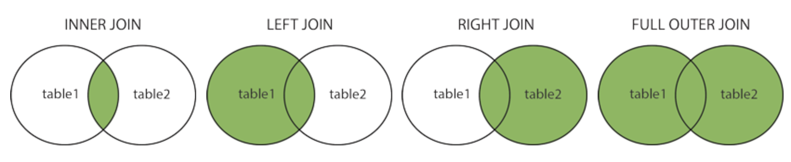

## SQL Tutorial

SQL, Structured Query Language, is a programming language designed to manage data stored in relational databases. SQL operates through simple, declarative statements. This keeps data accurate and secure, and helps maintain the integrity of databases, regardless of size.

## Why SQL?
Let's first look at some sample qualifications for the position of Data Scientist at Tech companies:
- 1.


- 2.


- 3.


- 4.


- 5.


They all require you to know how to write SQL queries. However, most of them only require a basic understanding of SQL. That's what we are going to do today :) The content of today's discussion follows more or less the turotial [here](https://www.w3schools.com/sql/default.asp).

## Data types in SQL

Some of the most common data types are:

- `INTEGER`: a positive or negative whole number
- `TEXT`: a text string
- `DATE`: the date formatted as YYYY-MM-DD
- `REAL`: a decimal value


## Relational Database (DBMS)
A DBMS is a software that interacts with a database. It can perform the following operations:
- Managing the access of a database
- Running SQL queries
- Writing data into the database
- Updating database
- Deleting data from the database

SQLite and MySQL, are the two most popular open source DBMS. We are going to use SQLite.

## SQLite3 in Python

### Start connect to sqlite3 server

[Documentation](https://docs.python.org/3/library/sqlite3.html)

To run our `sqlite3`, you need to first connect to a local/remote database via `.connect(NAME)`

Once you have a [Connection](https://docs.python.org/3/library/sqlite3.html#sqlite3.Connection), you can create a [Cursor](https://docs.python.org/3/library/sqlite3.html#sqlite3.Cursor) object and call its [execute()](https://docs.python.org/3/library/sqlite3.html#sqlite3.Cursor.execute) method to perform SQL commands. Also, you can use `fetchall()` command to get the results. Otherwise, you are merely displaying the *representation of the method*.

``` python
# Python3
import sqlite3
conn = sqlite3.connect(NAME)
cursor_obj = conn.cursor()
cursor_obj.execute(SQL_COMMAND)
cursor_obj.fetchall()
```

Firstly, let's try on this database I created: [people.db](../assets/people.db). It contains the name, age, ID, and occupation of some students, as well as their relationships. Here are the tables in that database. 

```
people_main(ID INTEGER, name TEXT, occupation TEXT, age INTEGER)
people_likes(ID1 INTEGER, ID2 INTEGER)
people_friends(ID1 INTEGER, ID2 INTEGER)
``` 
Open a Python console or Jupyter Notebook and type in the following commands (don't forget to import the `sqlite3` module):

``` python
# Python3
conn = sqlite3.connect('people.db')
cursor_obj = conn.cursor()
cursor_obj.execute('''
select * from people_main;
''')
cursor_obj.fetchall()[1:10]
```
## SQL Syntax
Here are the most commonly used commands, and I will introduce them one by one:

- **SELECT**  - extracts data from a database
- **INSERT INTO** - inserts new data into a database
- **DELETE** - deletes data from a database
- **CREATE TABLE** - creates a new table
- **AGGREGATE FUNCTIONS** - e.g. `AVG`, `COUNT`, `MAX`, `MIN`, `SUM`...
- **GROUP BY** - groups rows that have the same values
- **JOIN** - combine rows from two or more tables
- **WITH** - give a sub-query block a name
- **UNION** - combine the result-set of two or more SELECT statements
- **HAVING** - apply conditions over aggregation functions

Note: SQL keywords are NOT case sensitive: select is the same as SELECT, and some database systems require a semicolon at the end of each SQL statement.

### SELECT
```sql
SELECT column1, column2, ...
FROM table_name;
```
Select all
```sql
SELECT * FROM table_name;
```
**SELECT DISTINCT**:

The SELECT DISTINCT statement is used to return only distinct (different) values.
```sql
SELECT DISTINCT column1, column2, ...
FROM table_name;
```
**WHERE**

The WHERE clause is used to filter records.

```sql
SELECT column1, column2, ...
FROM table_name
WHERE condition;
```

**AND/OR/NOT**:

The WHERE clause can be combined with AND, OR, and NOT operators.

```sql
SELECT column1, column2, ...
FROM table_name
WHERE (NOT) condition1 AND/OR condition2;
```

**ORDER BY**

The ORDER BY keyword is used to sort the result-set in ascending or descending order.

```sql
SELECT column1, column2, ...
FROM table_name
ORDER BY column1, column2, ... ASC|DESC;
```

### Exercise
Select columns `name`, `age` and `occupation` from `people_main` whose `occupation` is Chefs or Librarians, and sort the output by age in the decreasing order.

### Insert into
The INSERT INTO statement is used to insert new records in a table.

```sql
INSERT INTO table_name
VALUES (value1, value2, value3, ...);
```

### Exercise 
Insert a new record where `ID = 101`, `name = Linquan Ma`, `occupation = TA`, `age = 23`.

### DELETE
The DELETE statement is used to delete existing records in a table.

```sql
DELETE FROM table_name WHERE condition;
```

For example, we can do
```sql
DELETE FROM people_main where ID = 101;
```

### Create a TABLE

To create a `SQL TABLE`, first you need to [CREAT TABLE](https://www.w3schools.com/sql/sql_create_table.asp), also declare columns' name and type

```sql
--SQLite3

CREATE TABLE table_name (
    column1 datatype,
    column2 datatype,
    column3 datatype,
   ....
);
```


### Show tables in current database

To show tables, in sqlite3 console you can use 
```sql
--SQLite3
SELECT name FROM sqlite_master WHERE type='table';
```

Equivalent, in python, we can do

```python
# Python3

command = "SELECT name FROM sqlite_master WHERE type='table';"
cursor_obj.execute(command)
print(cursor_obj.fetchall())
```

### Aggregate Functions
```sql
SELECT MIN|MAX|COUNT|AVG|SUM(column_name)
FROM table_name
WHERE condition;
```
We can use aggregate functions in varies ways. For example, by using `COUNT`, we can easily get the number of rows in a table:
```sql
SELECT COUNT(ID) FROM people_main;
```

### GROUP BY
The `GROUP BY` statement groups rows that have the same values into summary rows, like "find the number of people in each occupation". The GROUP BY statement is often used with aggregate functions (COUNT, MAX, MIN, SUM, AVG) to group the result-set by one or more columns.

For example, the following query counts the number of people in each occupation:
```sql
SELECT count(ID), occupation FROM people_main
GROUP BY occupation;
```
### JOIN
A `JOIN` clause is used to combine rows from two or more tables, based on a related column between them.

```sql
SELECT column_name(s)
FROM table1
(INNER) JOIN table2
ON table1.column_name = table2.column_name;
```

The table `people_likes`, based on following roles:

1. ID1 and ID2 should from people_main table
2. ID1 likes the person with ID2

Let's look at a selection from the `people_main` table:

```
 (1, 'Pheonix Chambers', 'Chefs', 35),
 (2, 'Shaquille Mcintosh', 'Librarians', 29),
 (3, 'Lailanie Mcfarland', 'Principals', 26),
 (4, 'Melana Christian', 'Receptionists', 32),
 (5, 'Nareh Li', 'Security Guard', 36),
 (6, 'Melena Combs', 'Coaches/Instructors', 43),
 ...
```
Then, look at a selection from the "people_likes" table:
```
 (1, 29),
 (4, 74),
 (4, 100),
 (5, 84),
 (7, 26),
 (8, 59),
 ...
```
Notice that the `ID` column in the `people_main` table refers to `ID1` (or `ID2`) in the "people_likes" table.

Then, we can create the following SQL statement that selects records that have matching values in both tables:
```sql
SELECT * FROM people_main
JOIN people_likes on people_main.ID = people_likes.ID1
ORDER BY people_main.ID
LIMIT 10;
```
Output:
```
 (1, 'Pheonix Chambers', 'Chefs', 35, 1, 29),
 (4, 'Melana Christian', 'Receptionists', 32, 4, 74),
 (4, 'Melana Christian', 'Receptionists', 32, 4, 100),
 (5, 'Nareh Li', 'Security Guard', 36, 5, 84),
 (7, 'Armondo Ortega', 'Opticians', 42, 7, 26),
 (8, 'Camryn Hart', 'Executives', 39, 8, 59),
 (9, 'Loren Oneal', 'Physios', 30, 9, 28),
 (11, 'Joas Thompson', 'Journalists (Not covering war)', 45, 11, 67),
 (11, 'Joas Thompson', 'Journalists (Not covering war)', 45, 11, 67),
 (11, 'Joas Thompson', 'Journalists (Not covering war)', 45, 11, 41)
```
**Different types of JOIN**



### Exercises
- Write a SQL statement that returns the name and number of people that he likes. Results should be ordered by count (descending), and then by name (A-Z). 

*Hint: First use `JOIN` to combine the two tables `people_main` and `people_likes`, and then use `GROUP BY` followed by `COUNT`.*

Consider the table `people_friends`, `(ID1, ID2)` simply means they are friends with each other. The enries satisfy

1. ID1 and ID2 should from people_main table
2. ID1 != ID2
3. If person with ID1 is friend with ID2, the revers should also be true

- Write a SQL statement to find pairs (A, B) such that person A likes person B, but A is not friends with B. Results should be ordered by ID1 (ascending), then ID2 (ascending).

*Hint: consider `left join`.*

### WITH
Often times, we want to combine two tables, but one of the tables is the result of another query. 
```sql
WITH previous_results AS (
   SELECT ...
   ...
   ...
   ...
)
SELECT *
FROM previous_results
JOIN people_main
  ON previous_results.__ = people_main.__;
```

### Exercises
- Write a SQL statement to find pairs (A, B) such that person A likes B

*Hint: first join people_main.ID with people_likes.ID1, then join output.ID2 with people_main.ID again. In this way, the first name likes the second name*

- Write a SQL statement that returns the occupation and and how many people like that occupation. Results should be ordered by popularity from high to low

*Hint: First join people_main with people_likes, then run group by command with count*

- Write a SQL statement that returns the distinct name and age of all people who are liked by anyone younger than them. Results should be ordered by name (A-Z)

### UNION
The UNION operator is used to combine the result-set of two or more SELECT statements.

```sql
SELECT column_name(s) FROM table1
UNION
SELECT column_name(s) FROM table2;
```

### HAVING
The HAVING clause was added to SQL because the WHERE keyword could not be used with aggregate functions.

Example, if I want to know the occupations that have more than 5 people, we can write the query as
```sql
SELECT occupation, count(*) FROM people_main
GROUP BY occupation
having count(*) > 5;
```
### Exercise:
- Write a SQL statement that returns the name and occupation of all people who have more than 3 friends. 

*Consider using `JOIN`, `GROUP BY`, `COUNT` and `HSVING`*

## Relational database

Different [Key types](https://www.dotnettricks.com/learn/sqlserver/different-types-of-sql-keys)

[**Primary key**](https://www.w3schools.com/sql/sql_primarykey.asp) is a set of one or more fields/columns of a table that uniquely identify a record in database table. It can not accept null, duplicate values. Only one Candidate Key can be Primary Key.

[**Foreign key**](https://www.w3schools.com/sql/sql_foreignkey.asp) is a field in database table that is Primary key in another table. It can accept multiple null, duplicate values. For more help refer the article [Difference between primary key and foreign key](http://www.dotnettricks.com/learn/sqlserver/difference-between-primary-key-and-foreign-key).

## Practice
Consider the following relational schema:


PK and FK stand for primary key and foreign key respectively.

We first generate the tables using the following code:
``` python
# In Python
conn = sqlite3.connect('computer.db')
cursor_obj = conn.cursor()
cursor_obj.execute('''
CREATE TABLE Manufacturers (
	Code INTEGER PRIMARY KEY NOT NULL,
	Name CHAR(50) NOT NULL 
);
''')
cursor_obj.execute('''
CREATE TABLE Products (
	Code INTEGER PRIMARY KEY NOT NULL,
	Name CHAR(50) NOT NULL ,
	Price REAL NOT NULL ,
	Manufacturer INTEGER NOT NULL 
		CONSTRAINT fk_Manufacturers_Code REFERENCES Manufacturers(Code)
);
''')
cursor_obj.execute('''
INSERT INTO Manufacturers(Code,Name) VALUES (1,'Sony'),
                                    (2,'Creative Labs'),
                                    (3,'Hewlett-Packard'),
                                    (4,'Iomega'),
                                    (5,'Fujitsu'),
                                    (6,'Winchester');   
''')
cursor_obj.execute('''
INSERT INTO Products(Code,Name,Price,Manufacturer) VALUES
(1,'Hard drive',240,5),
(2,'Memory',120,6),
(3,'ZIP drive',150,4),
(4,'Floppy disk',5,6),
(5,'Monitor',240,1),
(6,'DVD drive',180,2),
(7,'CD drive',90,2),
(8,'Printer',270,3),
(9,'Toner cartridge',66,3),
(10,'DVD burner',180,2);
''')

```
Now, based on the tables created, finish the following tasks:
- Select the names and the prices of all the products in the store.
- Select the name of the products with a price less than or equal to $200.
- Select the name and price in cents (i.e., the price must be multiplied by 100).
- Compute the average price of all the products.
- Select the name and price of all products with a price larger than or equal to $180, and sort first by price (in descending order), and then by name (in ascending order).
- Select the name and price of the cheapest product.
- Select the average price of each manufacturer's products, showing the manufacturer's name.

[Solutions](../assets/notebooks/sql_practice.html)

---
