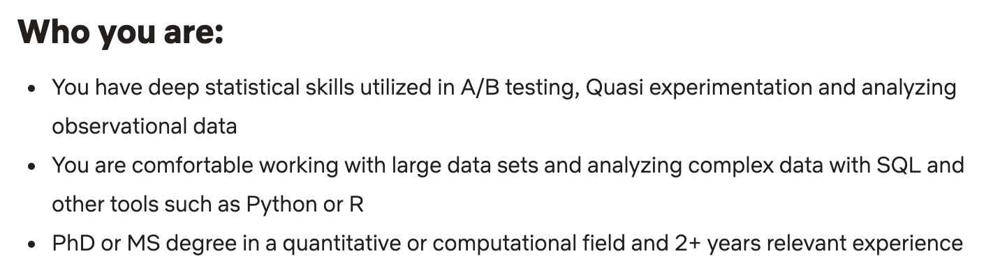
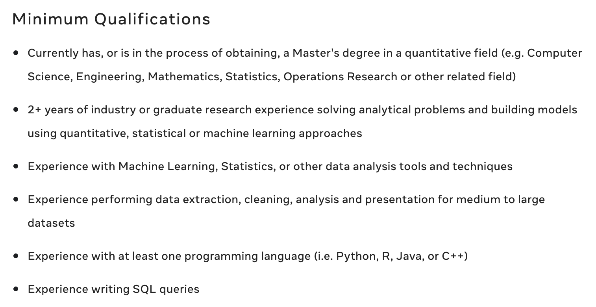
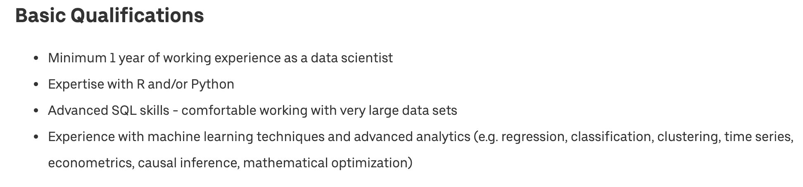

## SQL Tutorial

SQL, Structured Query Language, is a programming language designed to manage data stored in relational databases. SQL operates through simple, declarative statements. This keeps data accurate and secure, and helps maintain the integrity of databases, regardless of size.

## Why SQL?
Let's first look at some sample qualifications for the position of Data Scientist at Tech companies:
- 1.



- 2.


- 3.



- 4.


- 5.



They all require you to know how to write SQL queries. However, most of them only require a basic understanding of SQL. That's what we are going to do today :) The content of today's discussion follows more or less the turotial [here](https://www.w3schools.com/sql/default.asp).

## Data types in SQL

Some of the most common data types are:

- `INTEGER`: a positive or negative whole number
- `TEXT`: a text string
- `DATE`: the date formatted as YYYY-MM-DD
- `REAL`: a decimal value


## Relational Database (DBMS)
A DBMS is a software that interacts with a database. It can perform the following operations:
- Managing the access of a database
- Running SQL queries
- Writing data into the database
- Updating database
- Deleting data from the database

SQLite and MySQL, are the two most popular open source DBMS. We are going to use SQLite.

## SQLite3 in Python

### Start connect to sqlite3 server

[Documentation](https://docs.python.org/3/library/sqlite3.html)

To run our `sqlite3`, you need to first connect to a local/remote database via `.connect(NAME)`

Once you have a [Connection](https://docs.python.org/3/library/sqlite3.html#sqlite3.Connection), you can create a [Cursor](https://docs.python.org/3/library/sqlite3.html#sqlite3.Cursor) object and call its [execute()](https://docs.python.org/3/library/sqlite3.html#sqlite3.Cursor.execute) method to perform SQL commands. Also, you can use `fetchall()` command to get the results. Otherwise, you are merely displaying the *representation of the method*.

``` python
# Python3
import sqlite3
conn = sqlite3.connect(NAME)
cursor_obj = conn.cursor()
cursor_obj.execute(SQL_COMMAND)
cursor_obj.fetchall()
```

Firstly, let's try on this database I created: [people.db](../assets/people.db). It contains the name, age, ID, and occupation of some students, as well as their relationships. Here are the tables in that database. 

```
people_main(ID INTEGER, name TEXT, occupation TEXT, age INTEGER)
people_likes(ID1 INTEGER, ID2 INTEGER)
people_friends(ID1 INTEGER, ID2 INTEGER)
``` 
Open a Python console or Jupyter Notebook and type in the following commands (don't forget to import the `sqlite3` module):

``` python
# Python3
conn = sqlite3.connect('people.db')
cursor_obj = conn.cursor()
cursor_obj.execute('''
select * from people_main;
''')
cursor_obj.fetchall()[1:10]
```
## SQL Syntax
Here are the most commonly used commands, and I will introduce them one by one:

- **SELECT**  - extracts data from a database
- **UPDATE** - updates data in a database
- **DELETE** - deletes data from a database
- **INSERT INTO** - inserts new data into a database
- **CREATE TABLE** - creates a new table
- **GROUP BY** - groups rows that have the same values
- **JOIN** - combine rows from two or more tables
- **UNION** - combine the result-set of two or more SELECT statements

Note: SQL keywords are NOT case sensitive: select is the same as SELECT, and some database systems require a semicolon at the end of each SQL statement.

### SELECT
Syntax:
```sql
SELECT column1, column2, ...
FROM table_name;
```
Select all
```sql
SELECT * FROM table_name;
```
**SELECT DISTINCT**:

The SELECT DISTINCT statement is used to return only distinct (different) values.
```sql
SELECT DISTINCT column1, column2, ...
FROM table_name;
```
**WHERE**

The WHERE clause is used to filter records.

```sql
SELECT column1, column2, ...
FROM table_name
WHERE condition;
```

**AND/OR/NOT**:

The WHERE clause can be combined with AND, OR, and NOT operators.

```sql
SELECT column1, column2, ...
FROM table_name
WHERE (NOT) condition1 AND/OR condition2;
```

**ORDER BY**

The ORDER BY keyword is used to sort the result-set in ascending or descending order.

```sql
SELECT column1, column2, ...
FROM table_name
ORDER BY column1, column2, ... ASC|DESC;
```

### Exercise


### Create a TABLE

To create a `SQL TABLE`, first you need to [CREAT TABLE](https://www.w3schools.com/sql/sql_create_table.asp), also declare columns' name and type

```sql
--SQLite3

CREATE TABLE table_name (
    column1 datatype,
    column2 datatype,
    column3 datatype,
   ....
);
```
In Python, if you want to run a sql command, you need to pass a string to `cursor.execute(SQL_COMMAND: string)`

```python
# Python3

command = """
CREATE TABLE table_name (
    column1 datatype,
    column2 datatype,
    column3 datatype,
   ....
);
"""
cursor_obj.execute(command)
```

### Show tables in current database

To show tables, in sqlite3 console you can use `.tables`, more command from `.help`

```sql
--SQLite3

.tables
```

or 

```sql
--SQLite3

SELECT name FROM sqlite_master WHERE type='table';
```

Here the `SELECT` command is select object from database, once you executing a `SELECT` statement. 

Equivalent, in python, we can do

```python
# Python3

command = "SELECT name FROM sqlite_master WHERE type='table';"
cursor_obj.execute(command)
print(cursor_obj.fetchall())
```

You can either treat the cursor as an [iterator](https://docs.python.org/3/glossary.html#term-iterator), call the cursor’s [fetchone()](https://docs.python.org/3/library/sqlite3.html#sqlite3.Cursor.fetchone) method to retrieve a single matching row, or call [fetchall()](https://docs.python.org/3/library/sqlite3.html#sqlite3.Cursor.fetchall) to get a list of the matching rows.

### Insert one record in database

Once we create our base table, we can start insert records into the database.

In sqlite3, it is possible to write the `INSERT INTO` statement in two ways.

The first way specifies both the column names and the values to be inserted:

```sql
--SQLite3

INSERT INTO table_name (column1, column2, column3, ...)
VALUES (value1, value2, value3, ...);
```

or 

```sql
--SQLite3

INSERT INTO table_name
VALUES (value1, value2, value3, ...);
```

## Relational database

Different [Key types](https://www.dotnettricks.com/learn/sqlserver/different-types-of-sql-keys)

[**Primary key**](https://www.w3schools.com/sql/sql_primarykey.asp) is a set of one or more fields/columns of a table that uniquely identify a record in database table. It can not accept null, duplicate values. Only one Candidate Key can be Primary Key.

[**Foreign key**](https://www.w3schools.com/sql/sql_foreignkey.asp) is a field in database table that is Primary key in another table. It can accept multiple null, duplicate values. For more help refer the article [Difference between primary key and foreign key](http://www.dotnettricks.com/learn/sqlserver/difference-between-primary-key-and-foreign-key).


### Why?

Link TABLES together!

### Practice


The table `people_likes`, based on following roles:

1. ID1 and ID2 should from people_main table
2. ID1 likes the person with ID2
3. Suppose each person can only like one person


`people_friends` should based on:

1. ID1 and ID2 should from people_main table
2. ID1 != ID2
3. If person with ID1 is friend with ID2, the revers should also be true


---
